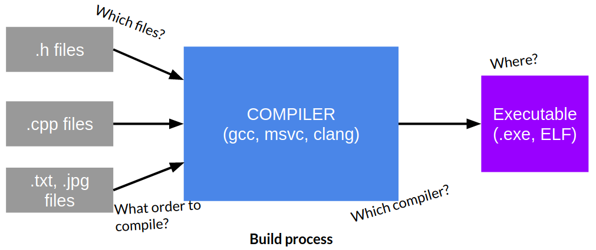
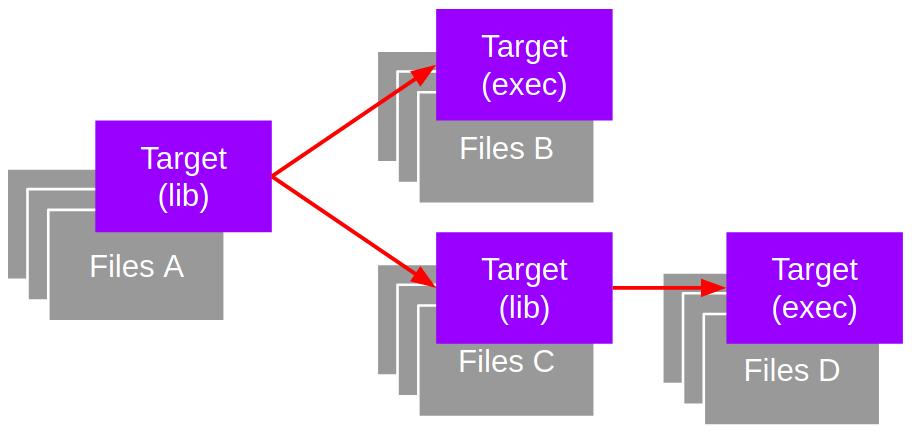

# 1. CMake is a build system
A build system is a tool that specifies which files need to be compiled for which
executable and specifies their dependencies.


For example, a project may need to output:
- Library A (`libA.cpp`, `libA.h`)
- Executable A (`execA.cpp`, `execA.h`)
- Library B (`libB.cpp`, `libB.h`)

Such that:
- Executable A depends on Library A
- Library B depends on Library A

We can define these files, outputs and dependencies in a build system. Then, the
build system will produce the correct outputs.

Essentially, a build system configures the build process.

# 2. Targets and Linking
A target is an output: either a library or an executable. A library is an output
that cannot be executed.



## 2.1 Define Targets
We can define a target by using the [`add_executable`](https://cmake.org/cmake/help/latest/command/add_executable.html)
 or [`add_library`](https://cmake.org/cmake/help/latest/command/add_library.html)
 command:
```
add_executable(name_of_exec_target
    execA.cpp
    otherFile.cpp
    ...
)

add_library(name_of_library_target
    libA.cpp
    otherFile.cpp
)
```

## 2.2 Add header files to targets
In addition to the `.cpp` files added to the target, you can add an include
_directory_ to the target using [`target_include_directories`](https://cmake.org/cmake/help/latest/command/target_include_directories.html)
. This will allow you
to `#include <...>`.

Consider:
```
/
    /src
        main.cpp
    /include
        a.h
        b.h
    CMakeLists.txt
```
main.cpp:
```
#include <a.h>
#include <b.h>
// ...
```

CMakeLists.txt
```
cmake_minimum_required(VERSION 2.8.11)
project(my_project_name)

add_executable(my_program
    src/main.cpp
)

target_include_directories(my_program
    include
)
```

## 2.3 Specify dependencies between targets
We can specify dependencies of libraries of executables with
[`target_link_libraries`](https://cmake.org/cmake/help/latest/command/target_link_libraries.html)
. Note that executables cannot be dependencies of other
executables.

Consider:
```
/
    lib/
        myLib/
            include/
            src/
                myLib.cpp
    include/
    src/
        main.cpp
    CMakeLists.txt
```
CMakeLists.txt
```
cmake_minimum_required(VERSION 2.8.11)
project(my_project_name)

# Define library target "my_lib_name"
add_library(my_lib_name
    lib/myLib/src/myLib.cpp
)
target_include_directories(my_lib_name
    lib/myLib/include
)

# Define library target "my_program"
add_executable(my_program
    src/main.cpp
)
target_include_directories(my_program
    include
)

# Define dependency of my_program on my_lib_name
target_link_libraries(my_program
    my_lib_name
)
```
