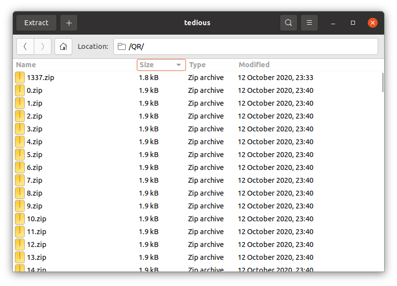

# Challenge Overview
[_Skip to solution_](#solution)

> My friend pranked me and hide my secret in one these!

A file named tedious.zip is attached. You can download it [here](./tedious.zip).

# Solution
Extracting the contents of tedious.zip, we get a file called tedious. This is
another zip file that contains a QR directory. Within the QR directory is 4255
other files.

By sorting the files by size, we can find the odd one out:

Extracting it, we realise that it is a png file containing a QR code. By scanning
the QR code, we get the flag: `LNC{IS_THlS_TH3_R3AL_0N3?}`:

