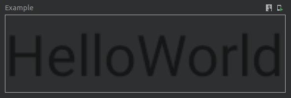
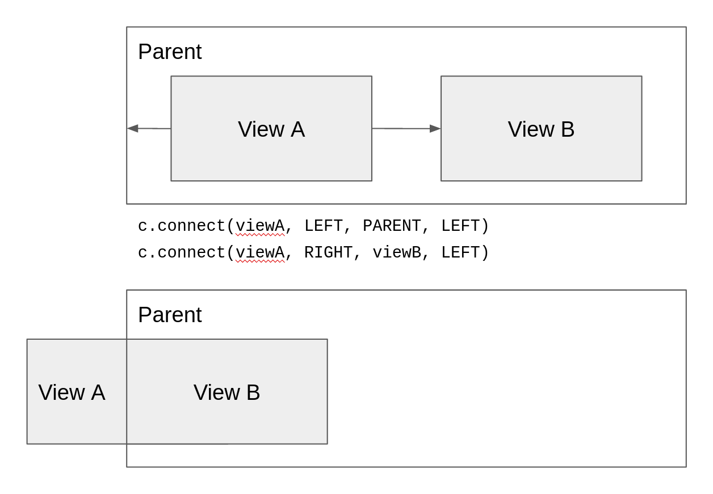
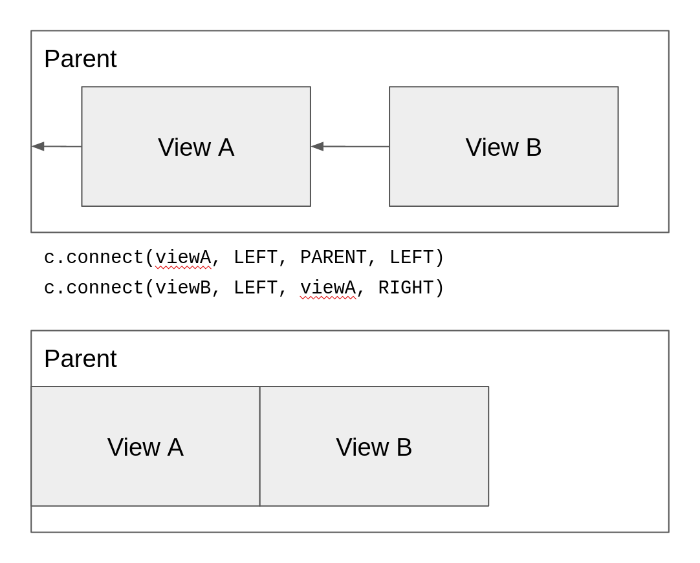

In this post, I will explain how to use `ConstraintSet` and why you have to do it
in this particular order. I will start with how to use it so that uninterested
readers can copy and paste and move on.

# Summary
Here is how you are supposed to use `ConstraintSet` with `ConstraintLayout`.
Take note of the order of the steps.

```kotlin
val layout = ConstraintLayout(context)
val tv1 = TextView(context)
tv1.text = "Hello"
val tv2 = TextView(context)
tv2.text = "World"

val c = ConstraintSet()

// Prerequisite: All children views of the constraint layout must have an ID
tv1.id = View.generateViewId()
tv2.id = View.generateViewId()

// 1. Add the views to the layout
layout.addView(tv1)
layout.addView(tv2)

// 2. Clone the layout
c.clone(layout)

// 3. Create your constraints
c.connect(tv1.id, ConstraintSet.TOP, ConstraintSet.PARENT_ID, ConstraintSet.TOP)
c.connect(tv2.id, ConstraintSet.TOP, ConstraintSet.PARENT_ID, ConstraintSet.TOP)

c.connect(tv1.id, ConstraintSet.START, ConstraintSet.PARENT_ID, ConstraintSet.START)
c.connect(tv2.id, ConstraintSet.START, tv1.id, ConstraintSet.END)

// 4. Apply your constraints to the layout
c.applyTo(layout)
```

The result:



If you are using a `ConstraintLayout` from a layout resource, you can skip the
first step as the views would have already been added to your layout. Simply
follow step 2 onwards. However, you will still need to have IDs for all the
child views of the `ConstraintLayout`.

# Behind The Scenes
We can understand how `ConstraintSet` by looking at the source code of the class
and we can find the source code [here](https://github.com/androidx/constraintlayout/blob/main/constraintlayout/constraintlayout/src/main/java/androidx/constraintlayout/widget/ConstraintSet.java).

Specifically, let's zoom in on the two methods we use: `clone` and `applyTo`.

Here is a **greatly** simplified and shortened implementation
```java
    public void clone(ConstraintLayout constraintLayout) {
        int count = constraintLayout.getChildCount();
        mConstraints.clear();

        for (int i = 0; i < count; i++) {
            View view = constraintLayout.getChildAt(i);
            int id = view.getId();

            if (id == -1) {
                throw new RuntimeException("All children of ConstraintLayout must "
                        + "have ids to use ConstraintSet");
            }

            if (!mConstraints.containsKey(id)) {
                mConstraints.put(id, new Constraint());
            }
            Constraint constraint = mConstraints.get(id);
            if (constraint == null) {
                continue;
            }

            // continue to initialize constraint...
        }
    }
```
See the actual implementation [here](https://github.com/androidx/constraintlayout/blob/24cfab8d390b1cd5758185ebda1f4bb62e02db10/constraintlayout/constraintlayout/src/main/java/androidx/constraintlayout/widget/ConstraintSet.java#L2519-L2576).

From the `clone(ConstraintLayout constraintLayout)` implementation, we can see
that a few key things are going on:
1. `clone` retrieves the children in the constraint layout
2. `clone` clears all of its current constraints
3. `clone` initialises constraints for each child view in constraint layout
4. `clone` throws an error if the view does not have an ID (`-1` means that no ID
was set)

And so, this means that `clone` can only be called after the layout has all of
its children, because it will to initialise the constraints for all of the
child views in the layout.

`applyTo` itself has a short implementation:
```java
    public void applyTo(ConstraintLayout constraintLayout) {
        applyToInternal(constraintLayout, true);
        constraintLayout.setConstraintSet(null);
        constraintLayout.requestLayout();
    }
```
It runs another method, `applyToInternal`, which somehow applies the constraints
to the constraint layout. After that `requestLayout()` will tell the constraint
layout to position its child views again, now with the new constraints (more
about [`requestLayout`](https://stackoverflow.com/questions/13856180/usage-of-forcelayout-requestlayout-and-invalidate)).

Let's look at `applyToInternal`. I have greatly simplified and shortened the
implementation here again:
```java
    void applyToInternal(ConstraintLayout constraintLayout, boolean applyPostLayout) {
        int count = constraintLayout.getChildCount();
        for (int i = 0; i < count; i++) {
            View view = constraintLayout.getChildAt(i);
            int id = view.getId();
            if (!mConstraints.containsKey(id)) {
                Log.w(TAG, "id unknown " + Debug.getName(view));
                continue;
            }

            if (id == -1) {
                throw new RuntimeException("All children of ConstraintLayout "
                        + "must have ids to use ConstraintSet");
                continue;
            }

            Constraint constraint = mConstraints.get(id);
            if (constraint == null) {
                continue;
            }
            
            ConstraintLayout.LayoutParams param = (ConstraintLayout.LayoutParams) view
                    .getLayoutParams();
            constraint.applyTo(param);

            // continue to set constraint properties to view...
        }
    }
```

Therefore, from the `applyTo(ConstraintLayout constraintLayout)` implementation, we can see
that:
1. `applyTo` also retrieves the children in the constraint layout
2. `applyTo` applies the constraints stored within `ConstraintSet` to the views
3. `applyTo` helps us to re-layout the child views, so there is no need to call
`requestLayout` after we're done.
4. `applyTo` also throws an error if the view does not have an ID

What this means is that `applyTo` needs the views inside the constraint layout
and it also needs to know all the constraints to apply.

So, if we put together these two ideas, we can see that we need to follow this
order:
1. Add the views to the layout
2. Run `clone` with the layout
3. Create constraints
4. Run `applyTo` with the layout

# Caveats
There are a few other gotchas to take note of when using `ConstraintSet`.

## 1. `connect` is not commutative
That is to say `connect(a, LEFT, b, RIGHT)` is **not** the same as
`connect(b, RIGHT, a, LEFT)`. Think of constraints as hands pulling on the view.
`connect(a, LEFT, b, RIGHT)` means that you have a hand coming out from the left
of `a` and it is trying to pull the right of `b` towards itself.

Let's ignore the vertical axis for now and see an example. Let's try to put
`viewA` on the left of `viewB` and have the whole thing flush to the left of the
parent.

```kotlin
c.connect(viewA, LEFT, PARENT, LEFT)
c.connect(viewA, RIGHT, viewB, LEFT)
```


The top half of the image shows how the constrains will "pull" the view, and the
bottom half shows the result.

By default, the view will be flushed to the start of the parent. So, since
`viewB` is unconstrained, it is positioned at the start of the parent. Then,
since `viewA` has two constrains, left to left of parent and right to left of
`viewB`, this means that `viewA` is positioned in the center of these two edges.

On the other hand, if we were to switch `viewA` and `viewB`:
```kotlin
c.connect(viewA, LEFT, PARENT, LEFT)
c.connect(viewB, LEFT, viewA, RIGHT)
```


Now, we can see that the `viewB` is being pulled towards `viewA`. So, when
`viewA` moves, `viewB` will move along with it. This gives us what we want.

## 2. All views to be constrained must have an ID
As mentioned above ConstraintSet will ignore views that do not have an ID. By
default, it will throw an error if the view has no ID, but this can be disabled
using [`constraintSet.setForceId(false)`](https://developer.android.com/reference/androidx/constraintlayout/widget/ConstraintSet#setForceId(boolean)).

Also note that you should follow the proper way to generate an ID. [`View.generateViewId()`](https://developer.android.com/reference/android/view/View.html#generateViewId%28%29)
for API level 17 and above and [`ViewCompat.generateViewId()`](https://developer.android.com/reference/android/view/View.html#generateViewId%28%29)
for API level below 17.

If you hardcode or generate `0` as an ID, it is invalid as `0` is used to
represent [a non-existent resource](https://developer.android.com/reference/android/content/res/Resources#ID_NULL).

# Conclusion
I hope my spending of half a day trying to fix this problem won't have to repeat
for you. Now with a better understanding, perhaps you won't have any problems
with this.
